## Screenshots

### Policy and learning

| Policy Assignment Management | Learning Mode |
|---|---|
| 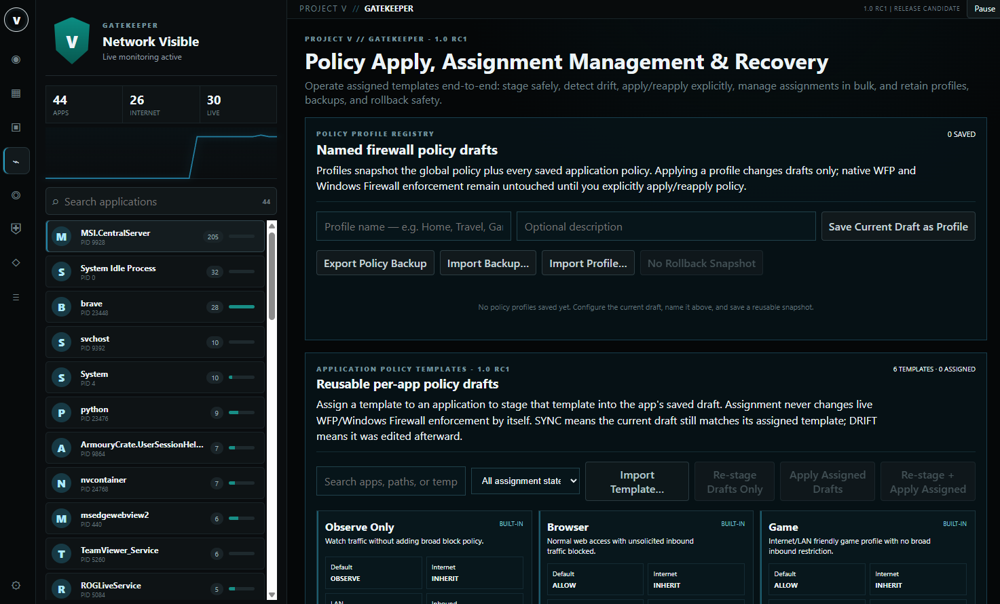 | 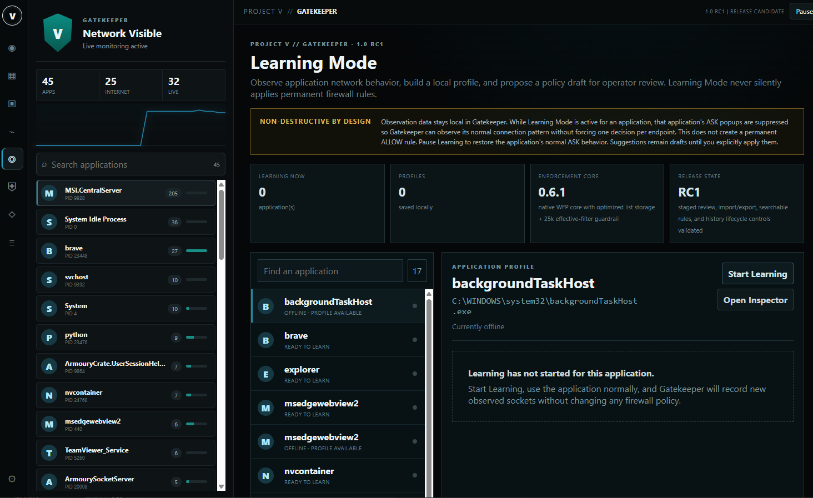 |

### Blocklists and privacy

| Blocklist Intelligence | Privacy Intelligence |
|---|---|
| 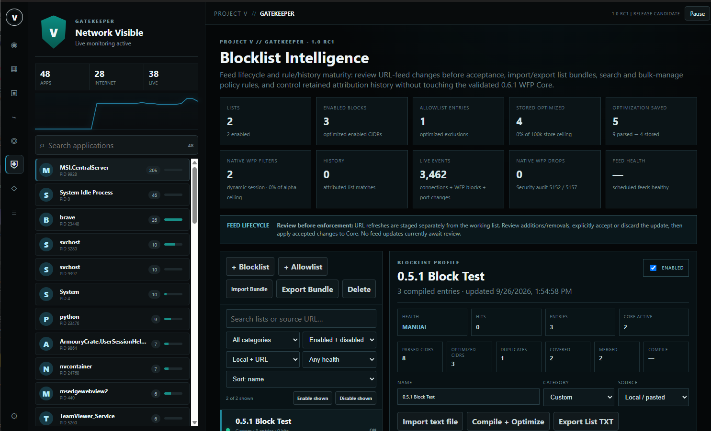 | 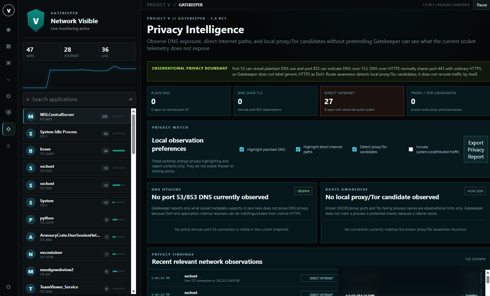 |

### Network intelligence

| Event Ledger | Application Connections |
|---|---|
| 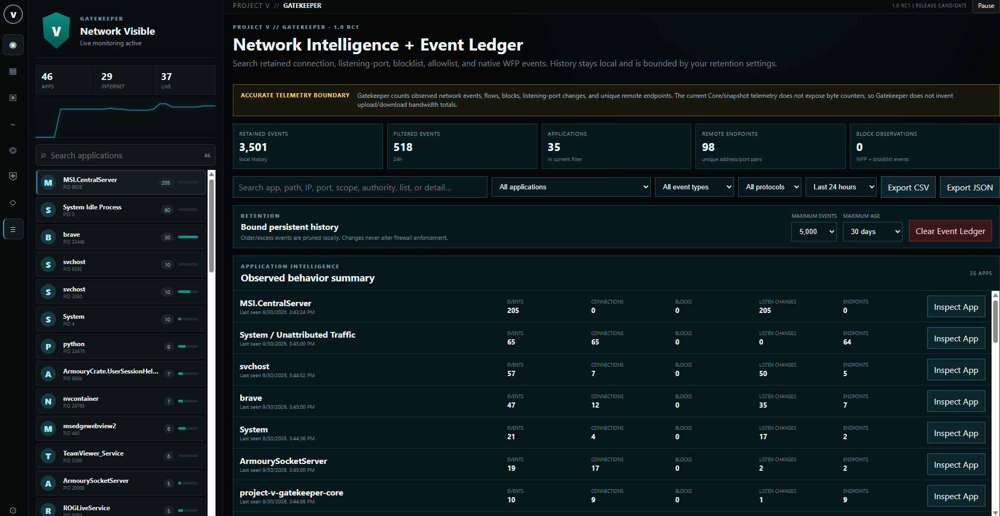 | 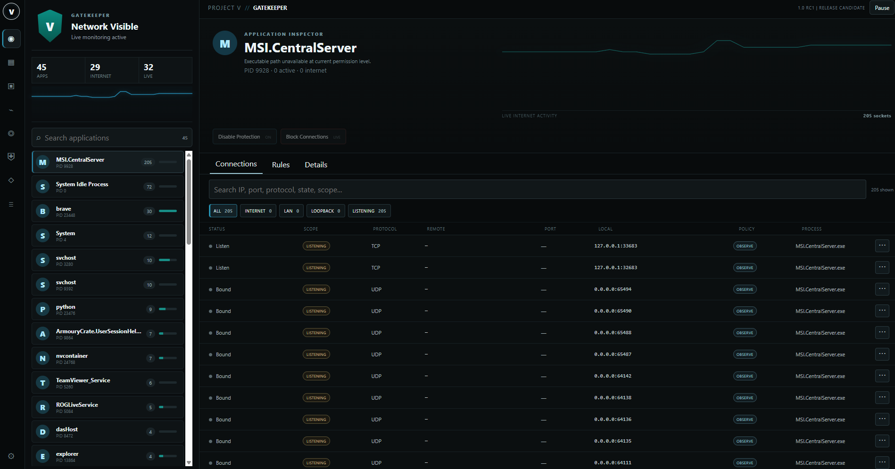 |

| Connection Actions | Application Firewall Rules |
|---|---|
| 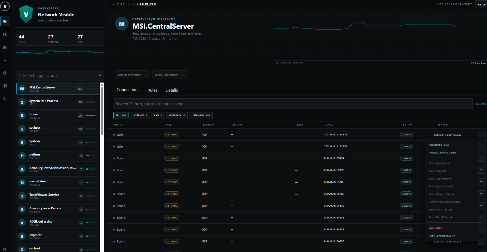 | 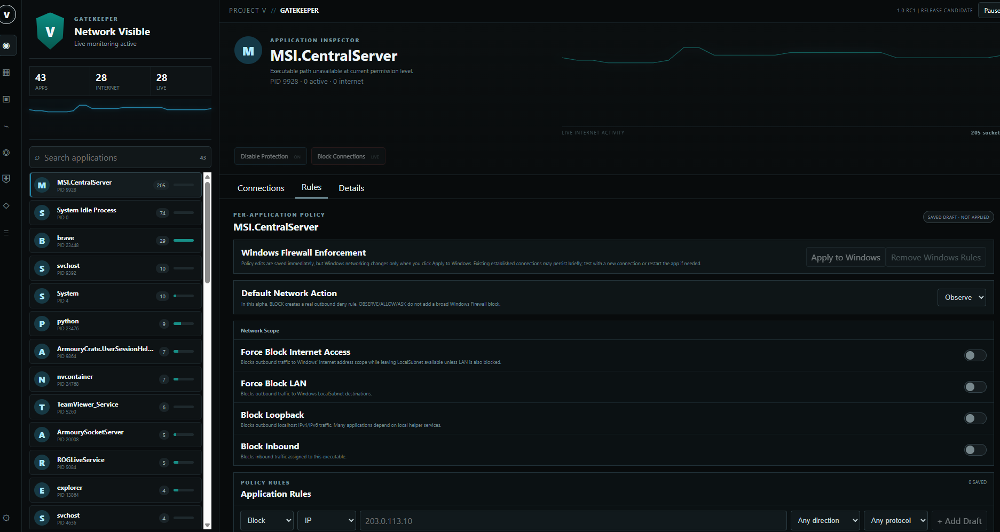 |

### Application control

| Application Details | Live Connections |
|---|---|
| 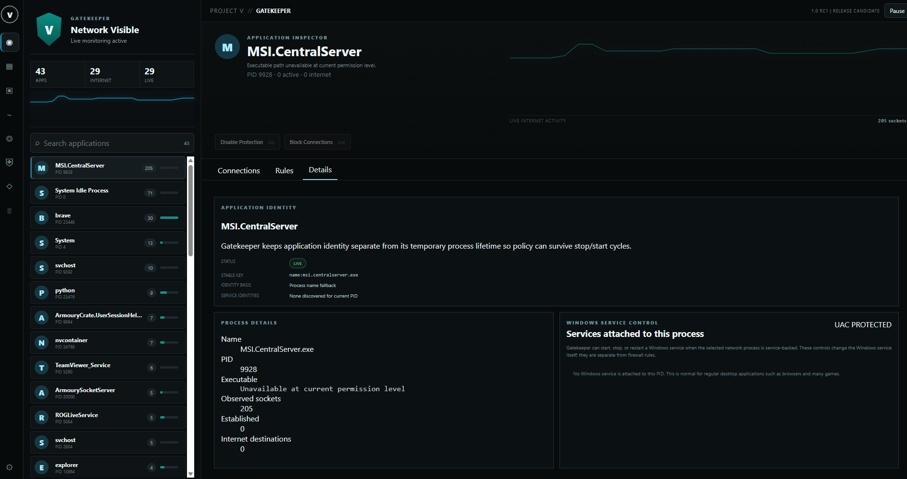 | 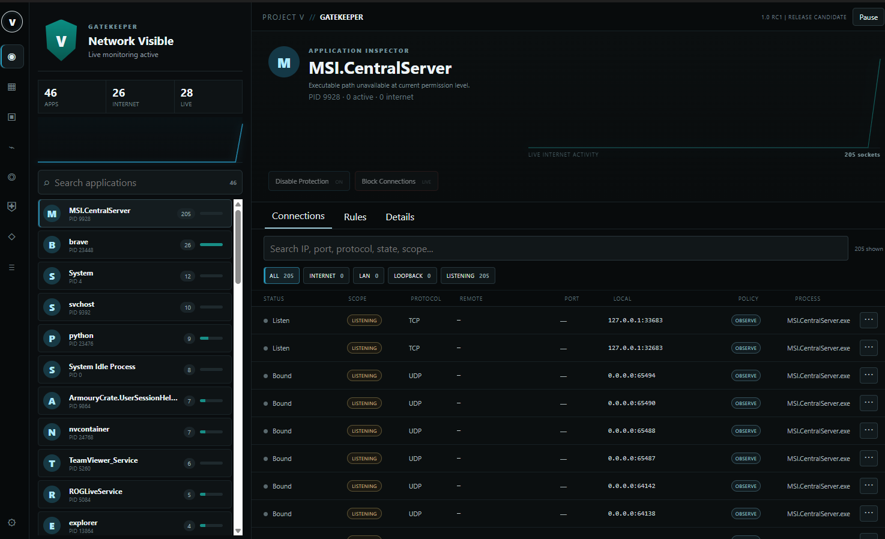 |

| Known Applications | Protected Applications |
|---|---|
| 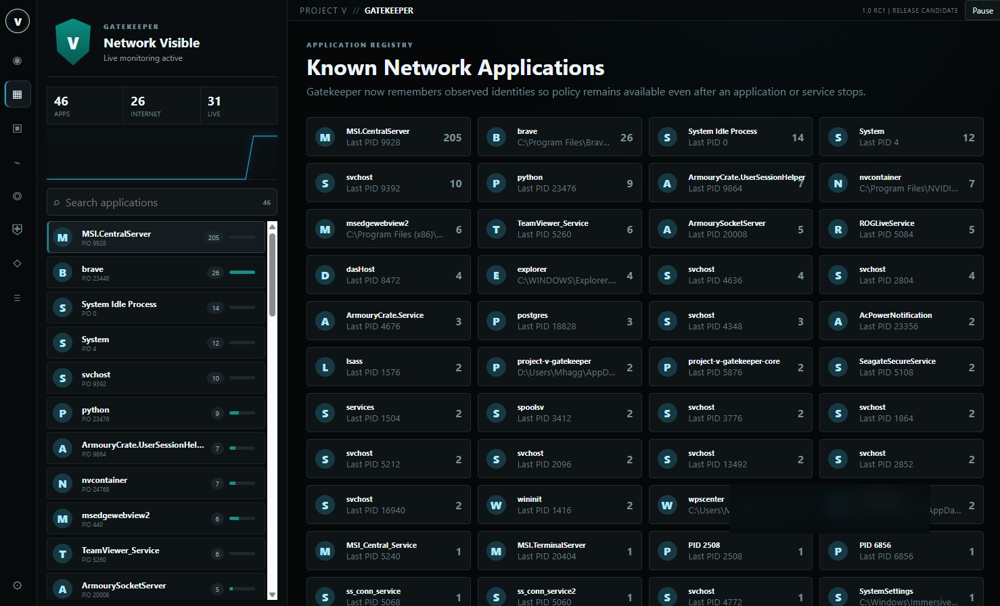 | 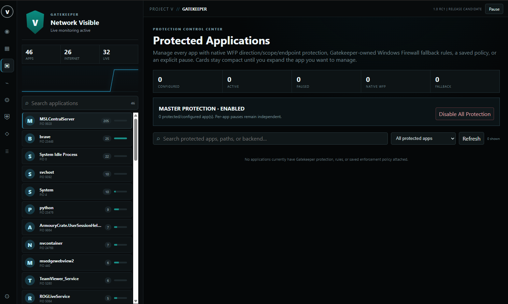 |

> Screenshots are representative of the Gatekeeper 1.0 RC1 / 1.0.0 interface. Sensitive machine-specific details have been redacted.
